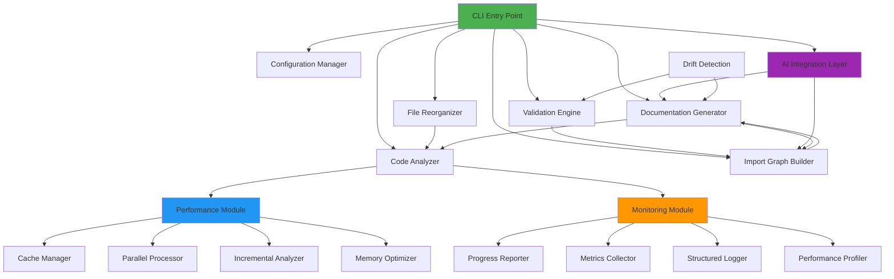
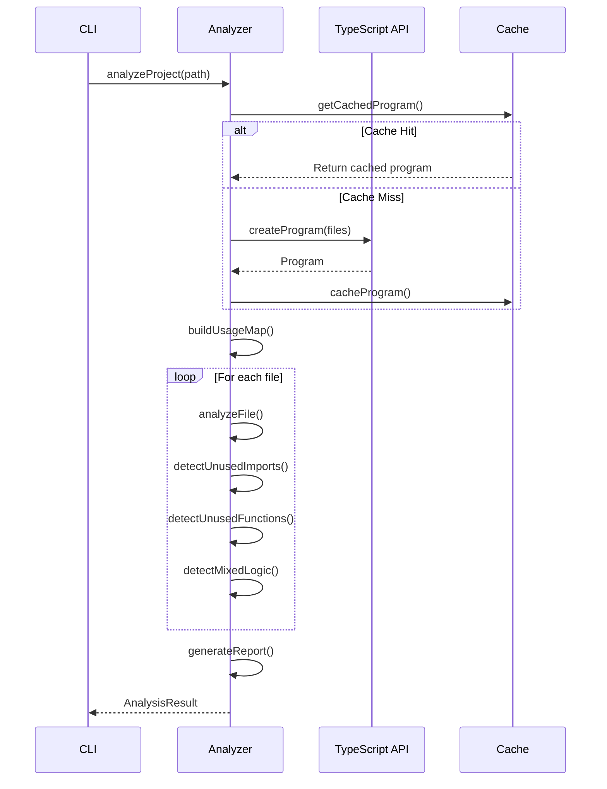
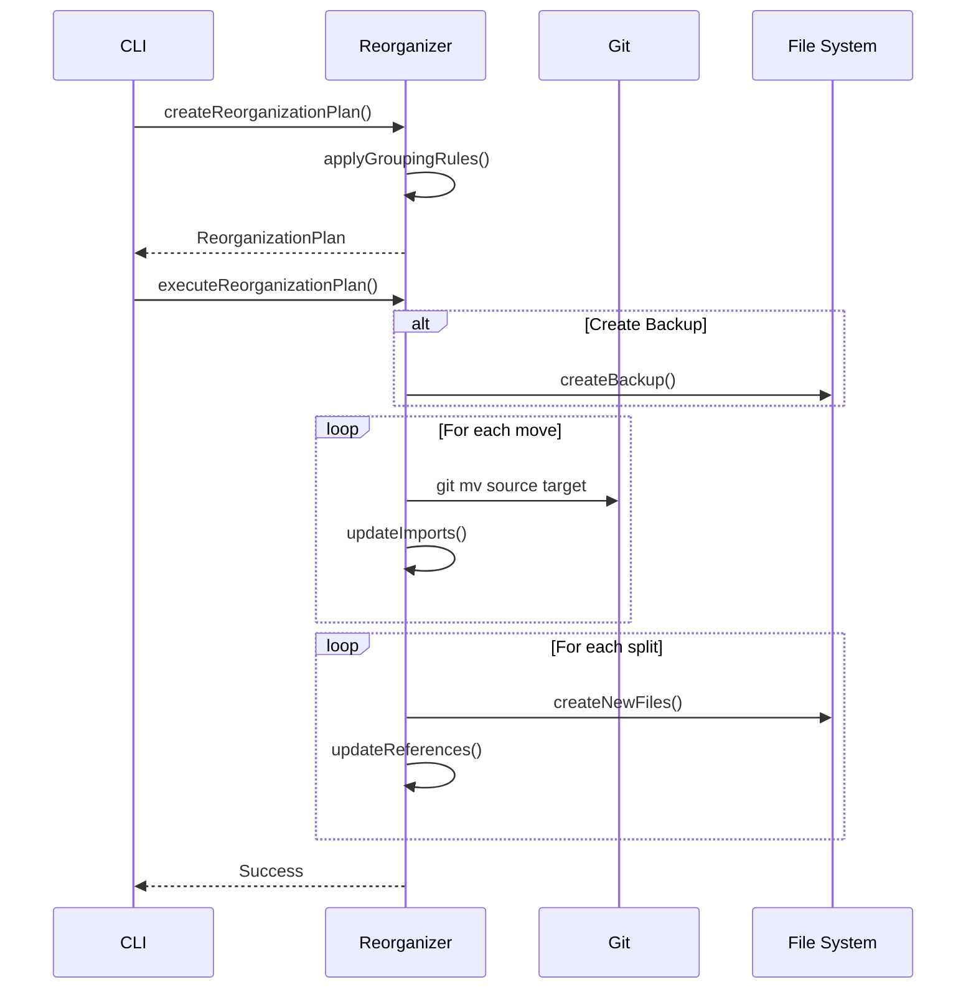
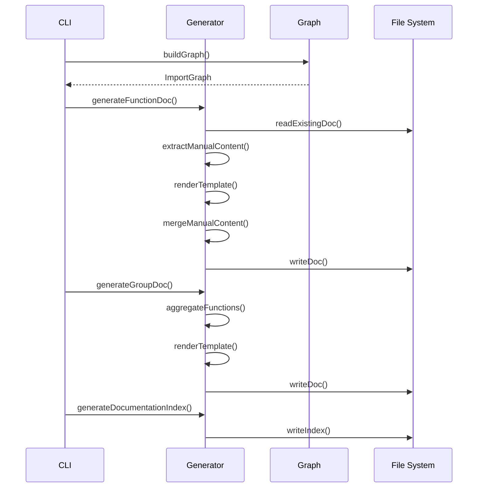
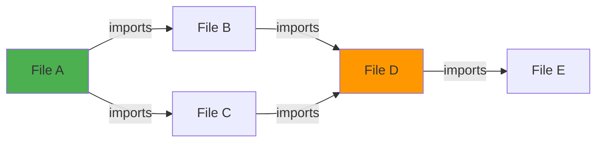
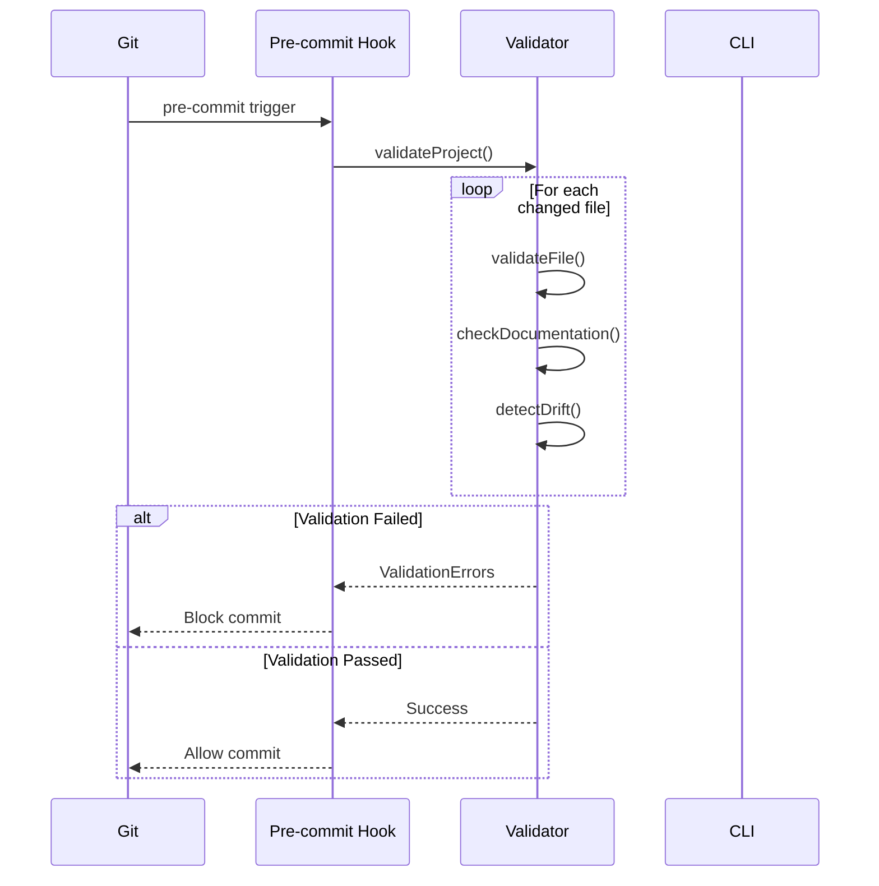
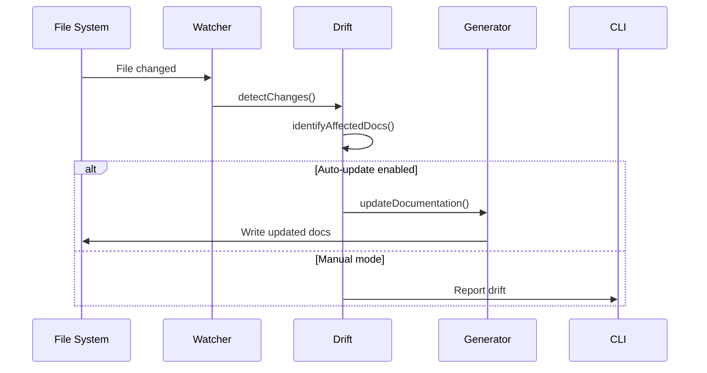
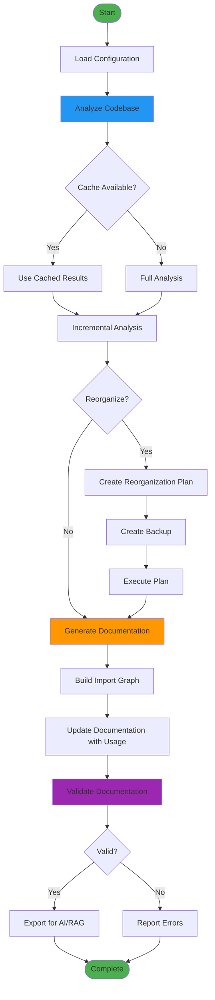

# Documentation System Architecture

## Overview

The Automated Documentation and Refactoring System is a comprehensive toolset for transforming TypeScript/JavaScript codebases into modular, self-documenting architectures. The system consists of multiple interconnected modules that work together to analyze, reorganize, document, and validate code.

## High-Level Architecture



## Module Architecture

### 1. CLI Module

**Purpose**: Command-line interface for all system operations

**Components**:
- Command parser (Commander.js)
- Configuration loader
- Command handlers
- Error handling

**Commands**:
- `analyze` - Analyze codebase for issues
- `reorganize` - Restructure files
- `document` - Generate documentation
- `validate` - Validate documentation
- `graph` - Build import graph
- `generate-all` - Complete workflow
- `install` - Install pre-commit hooks
- `ci` - Generate CI configuration
- `export` - Export for AI/RAG

### 2. Code Analyzer Module

**Purpose**: Analyze TypeScript/JavaScript code to detect issues

**Components**:
- TypeScript Compiler API integration
- AST traversal
- Usage tracking
- Complexity calculation
- Report generation

**Detects**:
- Unused imports
- Unused functions
- Unused components
- Mixed logic files
- Split entities
- Dead code

**Flow**:


### 3. File Reorganizer Module

**Purpose**: Restructure codebase based on analysis results

**Components**:
- Reorganization planner
- File mover
- Import updater
- File splitter
- Backup manager

**Grouping Rules**:
- Supabase → `lib/supabase/`
- Search → `lib/search/`
- Hooks → `hooks/`
- Services → `services/`
- Contexts → `contexts/`
- UI Components → `components/`
- Utils → `utils/`

**Flow**:


### 4. Documentation Generator Module

**Purpose**: Generate Markdown documentation for functions and groups

**Components**:
- Template engine
- Function documentation generator
- Group documentation generator
- Manual content preserver
- Documentation index generator

**Templates**:
- Function documentation template
- Group documentation template
- Index template

**Flow**:


### 5. Import Graph Builder Module

**Purpose**: Build dependency graph of imports and exports

**Components**:
- Import analyzer
- Export analyzer
- Graph builder
- Circular dependency detector
- Graph exporter (Mermaid, JSON, GraphML)

**Graph Structure**:


### 6. Validation Engine Module

**Purpose**: Validate documentation completeness and accuracy

**Components**:
- Validation rules
- Documentation validator
- Drift detector
- Pre-commit hook installer
- CI configuration generator

**Validation Rules**:
1. Missing documentation
2. Outdated signatures
3. Empty purpose sections
4. Broken references
5. Invalid format

**Flow**:


### 7. AI Integration Layer Module

**Purpose**: Export documentation for AI/RAG systems

**Components**:
- RAG exporter
- Graph query API
- Embedding generator
- Graph exporter (GraphML)

**RAG Export Format**:
```json
{
  "documents": [
    {
      "id": "func-123",
      "content": "Function documentation...",
      "metadata": {
        "type": "function",
        "filePath": "src/utils/helper.ts",
        "group": "utils",
        "complexity": 5,
        "dependencies": ["lodash", "date-fns"]
      },
      "embedding": [0.1, 0.2, ...]
    }
  ],
  "metadata": {
    "totalDocuments": 150,
    "groups": ["utils", "hooks", "services"],
    "generatedAt": "2024-01-01T00:00:00Z",
    "version": "1.0.0"
  }
}
```

### 8. Performance Module

**Purpose**: Optimize performance for large codebases

**Components**:

#### Cache Manager
- TypeScript program caching
- AST caching
- Analysis result caching
- File hash-based invalidation

#### Parallel Processor
- Worker thread pool
- Batch processing
- Progress reporting
- Error handling

#### Incremental Analyzer
- File change detection
- State persistence
- Incremental analysis
- Result merging

#### Memory Optimizer
- Memory monitoring
- Garbage collection
- Streaming processing
- Batch size optimization

**Performance Gains**:
- **Cache Hit Rate**: 80-90%
- **Memory Reduction**: 50-75%
- **Speed Improvement**: 3-4x with parallel processing
- **Incremental Speed**: 10x for unchanged files

### 9. Monitoring Module

**Purpose**: Provide observability and diagnostics

**Components**:

#### Progress Reporter
- Visual progress bars
- ETA calculation
- Speed tracking
- Multi-progress support

#### Metrics Collector
- Timing metrics
- Counter metrics
- Gauge metrics
- Summary statistics

#### Structured Logger
- Multiple log levels
- Colored output
- Context objects
- Error stack traces

#### Performance Profiler
- Hierarchical profiling
- Call tree visualization
- Hotspot identification
- Decorator support

### 10. Drift Detection Module

**Purpose**: Prevent documentation from becoming outdated

**Components**:
- Change detector (file watcher)
- Auto-updater
- Drift detector
- Drift reporter

**Drift Detection Flow**:


## Data Flow

### Complete Workflow



## Technology Stack

### Core Technologies
- **Language**: TypeScript 5.x
- **Runtime**: Node.js 18+
- **CLI Framework**: Commander.js
- **Code Analysis**: TypeScript Compiler API

### File Operations
- **File System**: fs-extra
- **Git Integration**: simple-git
- **File Watching**: chokidar

### Documentation
- **Templates**: Handlebars
- **Markdown Parsing**: remark

### Configuration
- **Config Loading**: cosmiconfig
- **Validation**: JSON Schema

### Testing
- **Test Framework**: Vitest
- **Coverage**: Vitest coverage

## Design Patterns

### 1. Builder Pattern
Used in: Import Graph Builder, Documentation Generator

### 2. Strategy Pattern
Used in: Grouping Rules, Validation Rules

### 3. Observer Pattern
Used in: File Watcher, Progress Reporter

### 4. Singleton Pattern
Used in: Global Metrics, Global Logger, Global Profiler

### 5. Factory Pattern
Used in: Template Creation, Report Generation

### 6. Decorator Pattern
Used in: Performance Profiling (@Profile decorator)

## Error Handling Strategy

### Error Categories

1. **Parse Errors**: TypeScript compilation errors
   - Strategy: Log and skip file, continue processing

2. **File System Errors**: Permission denied, file not found
   - Strategy: Fail fast with clear error message

3. **Validation Errors**: Missing documentation, outdated signatures
   - Strategy: Collect all errors, present summary

4. **Import Resolution Errors**: Cannot resolve import path
   - Strategy: Log warning, mark as unresolved, continue

### Error Recovery

- **Atomic Operations**: File moves wrapped in transactions
- **Backup Creation**: Automatic backup before destructive operations
- **Rollback Capability**: Can revert to previous state
- **Partial Success**: Continue processing other files if one fails

## Performance Characteristics

### Time Complexity

- **File Discovery**: O(n) where n = number of files
- **AST Parsing**: O(n * m) where m = average file size
- **Usage Map Building**: O(n * k) where k = average identifiers per file
- **Import Graph Building**: O(n + e) where e = number of edges

### Space Complexity

- **Without Optimization**: O(n * m) - all files in memory
- **With Caching**: O(c) where c = cache size (configurable)
- **With Streaming**: O(1) - constant memory per file

### Scalability

- **Small Projects** (< 100 files): ~10 seconds
- **Medium Projects** (100-1000 files): ~1-2 minutes
- **Large Projects** (1000+ files): ~5-10 minutes
- **Very Large Projects** (10000+ files): ~30-60 minutes

## Security Considerations

1. **File System Access**: Validate all paths to prevent directory traversal
2. **Code Execution**: Never use eval() or execute generated code
3. **Backup Integrity**: Verify backup creation before destructive operations
4. **Git Safety**: Use git mv to preserve history
5. **Configuration Validation**: Validate all user-provided configuration
6. **Error Messages**: Avoid exposing sensitive paths in public logs

## Extension Points

### Custom Grouping Rules

```typescript
const customRule: GroupingRule = {
  name: 'Custom',
  pattern: /custom-pattern/i,
  targetDirectory: 'custom',
  priority: 1,
};
```

### Custom Validation Rules

```typescript
const customRule: ValidationRule = {
  name: 'custom-rule',
  check: (file, doc) => {
    // Custom validation logic
    return null; // or ValidationError
  },
  severity: 'error',
};
```

### Custom Templates

```typescript
const customTemplate = `
# {{functionName}}

**Custom Section**: {{customData}}

{{#each parameters}}
- {{name}}: {{type}}
{{/each}}
`;
```

## Future Enhancements

1. **Distributed Processing**: Support for distributed analysis across multiple machines
2. **Cloud Storage**: Store documentation in cloud storage (S3, GCS)
3. **Real-time Collaboration**: Multi-user documentation editing
4. **AI-Powered Suggestions**: Use AI to suggest documentation improvements
5. **Visual Studio Code Extension**: IDE integration
6. **Web Dashboard**: Web-based monitoring and management
7. **Plugin System**: Support for third-party plugins
8. **Multi-language Support**: Support for other languages (Python, Java, etc.)

## Maintenance

### Regular Tasks

1. **Cache Cleanup**: Run `doc-system cache --clear` monthly
2. **State Validation**: Verify incremental state integrity
3. **Log Rotation**: Rotate log files to prevent disk space issues
4. **Dependency Updates**: Keep dependencies up to date
5. **Performance Monitoring**: Review metrics regularly

### Troubleshooting

See individual module READMEs for detailed troubleshooting guides:
- [Performance Module](./performance/README.md)
- [Monitoring Module](./monitoring/README.md)
- [Validation Module](./validation/README.md)
- [AI Integration Module](./ai/README.md)
